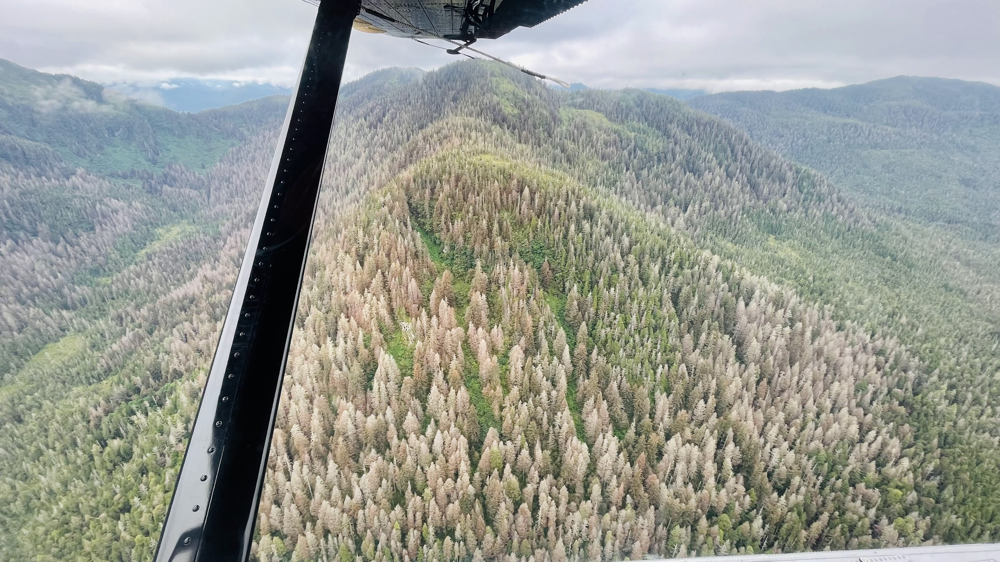
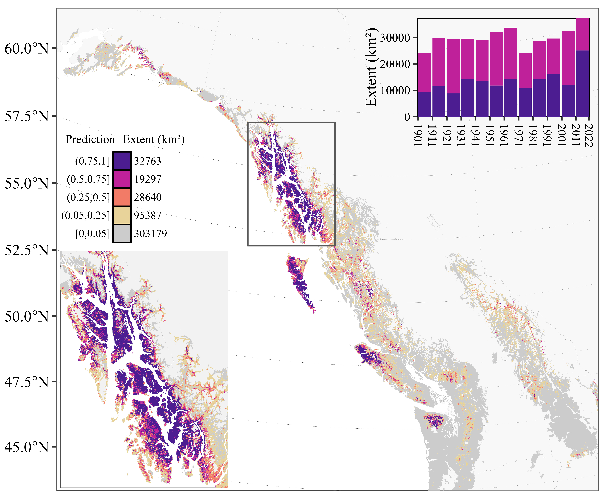

## 1) Outbreak dynamics of forest insect herbivores

Population irruptions (*i.e.*, outbreaks) by native forest insect herbivores are a leading cause of disturbance across forested landscapes. The extent and severity of these outbreaks, whether caused by sawflies, caterpillars, or bark beetles, are affected by both the long-term effects of climate and the short-term effects of fluctuating weather. As a result, outbreaks by forest are highly sensitive to climatic change.

### A) Biogeography of insect outbreak distributions

Population irruptions (*i.e.*, outbreaks) by native forest insect herbivores are a leading cause of disturbance across forested landscapes. The extent and severity of these outbreaks, whether caused by sawflies, caterpillars, or bark beetles, are mediated by both the long-term effects of climate and the short-term effects of fluctuating weather. As a result, outbreaks by forest are highly sensitive to climatic change.

{fig-align="center"}

### B) Climate-mediated range expansions of native herbivores

### C) How do outbreaks start?

### D) How do

::::: columns
::: {.column width="50%"}
##### Active Projects

-   Spruce beetle outbreak distribution (late 2024)
-   Latitudinal distribution of Spongy moth outbreaks (late 2024)
-   Impacts of spruce beetle development rate on outbreak likelihood (early 2025)
-   Forest Ecology 
-   Disturbance  x 
-   Climate Change 
:::

::: {.column width="50%"}
##### Published Projects

-   Nordic skiing 
-   mountain biking 
-   trail running 
-   soccer 
-   travel 
-   mountains 
:::
:::::

## 2) Disturbance interactions

## 3) Climate change ecology

## 4) Insect-Tree Interactions

::::: columns
::: {.column width="50%"}
-   R 
-   Machine Learning 
-   Forest Entomology 
-   Forest Ecology 
-   Disturbance  x 
-   Climate Change 
:::

::: {.column width="50%"}
##### Personal Interests:

-   Nordic skiing 
-   mountain biking 
-   trail running 
-   soccer 
-   travel 
-   mountains 
:::
:::::